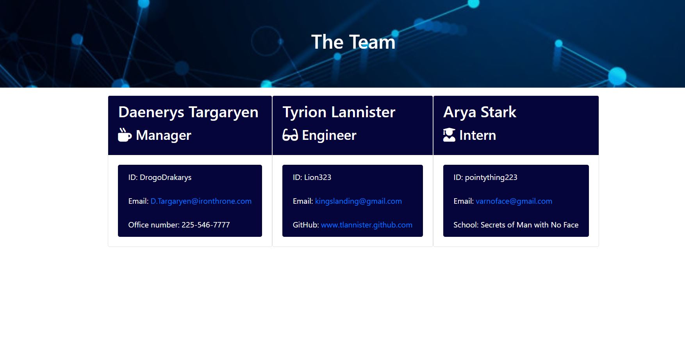

# Employee-Summary

## Instructions
This Employee-Summary is a command line application using Node JS and MySQL. This is boiled down to three types of employees; Manager, Engineer, and Intern. Each have their own information. 

By initializing 

 The application will prompt the user for information about the team manager and then information about the team members. The user can input any number of team members, and they may be a mix of engineers and interns. This assignment must also pass all unit tests. When the user has completed building the team, the application will create an HTML file that displays a nicely formatted team roster based on the information provided by the user. 

## Minimum Requirements
Functional application.

GitHub repository with a unique name and a README describing the project.

User can use the CLI to generate an HTML page that displays information about their team.

All tests must pass.

<a href="https://drive.google.com/file/d/1uXhhehy7qxzO4n7wQAaLNsh8K1HNV_HG/view">Click here to view video of application in action!</a>

